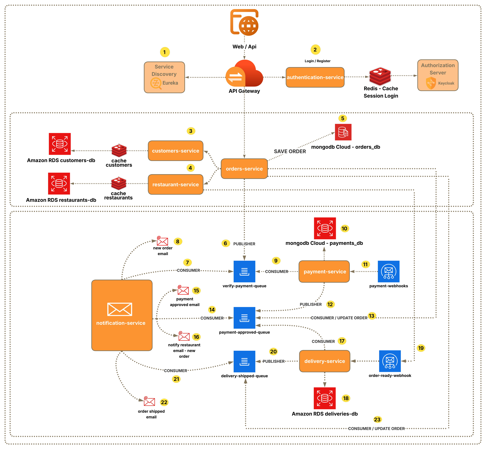
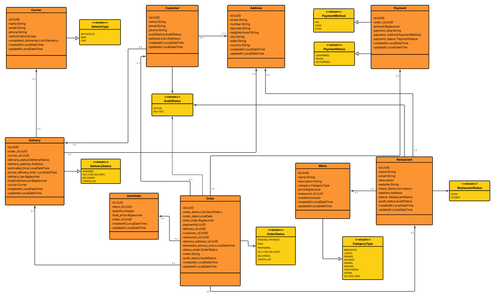

# 🍔 Delivery System Microservices

A delivery backend system built with microservices architecture, asynchronous event-driven communication, and centralized authentication through Keycloak.

The project simulates a complete order flow, from customer and restaurant registration to order creation, payment processing, delivery start, and notification dispatch. Its main goal is to demonstrate a distributed backend architecture with clear service ownership, database-per-service persistence, and integration between business domains.

## Overview

This repository is a monorepo composed of independent Spring Boot services. Each service has its own `pom.xml`, `Dockerfile`, environment configuration, and test suite.

Services communicate in two main ways:

- REST/Feign: used for synchronous domain queries, such as retrieving customer, restaurant, menu, or order data.
- RabbitMQ: used for business events, such as order creation, payment approval, delivery updates, and user deletion.

External traffic goes through the API Gateway, while Eureka Server provides dynamic service registration and discovery.

## Architecture

<div align="center">
  
</div>

### Core Components

| Component | Responsibility |
| --- | --- |
| API Gateway | Single entry point for the application, responsible for routing requests to microservices and integrating with OAuth2/JWT security. |
| Eureka Server | Service registry and discovery for all microservices. |
| Keycloak | Identity provider responsible for authentication, token issuing, and access control. |
| RabbitMQ | Message broker used for asynchronous communication between services. |
| Redis | Cache layer for data and tokens in services that need to reduce repeated calls. |
| PostgreSQL | Relational database used by customers, restaurants, deliveries, and Keycloak. |
| MongoDB | Document database used by orders and payments. |

## Services

| Service | Description | Persistence |
| --- | --- | --- |
| `authentication-service` | Handles login, customer/restaurant registration in Keycloak, and internal service authentication. | Keycloak + Redis |
| `customers-service` | Manages customers, profiles, and delivery addresses. Publishes an event when a customer is removed. | PostgreSQL + Redis |
| `restaurants-service` | Manages restaurants, operating status, and menu items. Publishes an event when a restaurant is removed. | PostgreSQL + Redis |
| `orders-service` | Creates orders, calculates totals, validates customer/restaurant/menu data, and tracks order status changes. | MongoDB |
| `payments-service` | Processes payments asynchronously, simulates an external gateway integration, and publishes payment confirmation events. | MongoDB |
| `delivery-service` | Creates deliveries after payment approval, assigns a courier, and updates delivery status. | PostgreSQL |
| `notification-service` | Consumes events and sends email notifications using HTML templates. | No dedicated database |
| `infrastructure-service/gateway` | Gateway service based on Spring Cloud Gateway. | - |
| `infrastructure-service/eureka` | Service discovery based on Netflix Eureka. | - |

## Main Flow

1. A customer or restaurant is registered through the `authentication-service`.
2. The authentication service creates the user in Keycloak and calls the related domain service.
3. The customer creates an order in the `orders-service`.
4. The order is validated using customer, address, restaurant, and menu data.
5. The `orders-service` publishes an event to start payment verification.
6. The `payments-service` creates the payment, simulates processing, and receives confirmation through a webhook.
7. After authorization, the approved payment event is published to orders, deliveries, and notifications.
8. The `delivery-service` creates the delivery and allows the status to move to out for delivery.
9. The `notification-service` sends emails during the main order lifecycle steps.

## Event Communication

| Source | Event/Queue/Exchange | Consumers | Purpose |
| --- | --- | --- | --- |
| Orders | `ORDERS_RABBITMQ_EXCHANGE_VERIFY_PAYMENT` | Payments, Notifications | Start payment processing and notify that the order was received. |
| Payments | `PAYMENTS_RABBITMQ_PUBLISHER_EXCHANGE` | Orders, Delivery, Notifications | Notify that the payment was authorized. |
| Delivery | `DELIVERIES_RABBITMQ_PUBLISHER_DELIVERY_READY` | Orders, Notifications | Notify delivery status updates. |
| Customers | `CUSTOMERS_DELETED_QUEUE` | Authentication | Remove the user from Keycloak after customer deletion. |
| Restaurants | `RESTAURANT_DELETED_QUEUE` | Authentication | Remove the user from Keycloak after restaurant deletion. |

Final queue and exchange names are configured through environment variables, as shown in `.env.example` and `docker-compose.yml`.

## Main Endpoints

The endpoints below are exposed by the services and can be accessed through the gateway according to the route configuration.

### Authentication

| Method | Endpoint | Description |
| --- | --- | --- |
| POST | `/api/auth/login` | Authenticates a user and returns an access token. |
| POST | `/api/auth/internal-login` | Generates a token for internal service-to-service communication. |
| POST | `/api/auth/signUp-customers` | Registers a customer and its identity in Keycloak. |
| POST | `/api/auth/signUp-restaurants` | Registers a restaurant and its identity in Keycloak. |

### Customers

| Method | Endpoint | Description |
| --- | --- | --- |
| POST | `/api/customers` | Creates a customer. |
| GET | `/api/customers/{id}` | Retrieves a customer by ID. |
| DELETE | `/api/customers/{id}` | Deletes a customer and publishes a deletion event. |
| GET | `/api/customers/profile` | Retrieves the authenticated customer's profile. |
| DELETE | `/api/customers/profile` | Deletes the authenticated customer's profile. |
| POST | `/api/customers/my-addresses` | Creates an address for the authenticated customer. |
| GET | `/api/customers/my-addresses/{id}` | Retrieves an address by ID. |

### Restaurants and Menu

| Method | Endpoint | Description |
| --- | --- | --- |
| POST | `/api/restaurants` | Creates a restaurant. |
| GET | `/api/restaurants` | Lists restaurants with optional filters. |
| GET | `/api/restaurants/{id}` | Retrieves a restaurant by ID. |
| DELETE | `/api/restaurants/{id}` | Deletes a restaurant and publishes a deletion event. |
| GET | `/api/restaurants/profile` | Retrieves the authenticated restaurant's profile. |
| DELETE | `/api/restaurants/profile` | Deletes the authenticated restaurant's profile. |
| PATCH | `/api/restaurants/profile` | Toggles restaurant status between `OPEN` and `CLOSED`. |
| POST | `/api/restaurants/{restaurantId}/menus` | Creates a menu item. |
| GET | `/api/restaurants/{restaurantId}/menus/{id}` | Retrieves an available menu item. |
| PATCH | `/api/restaurants/{restaurantId}/menus/{id}` | Toggles menu item availability. |
| DELETE | `/api/restaurants/{restaurantId}/menus/{id}` | Disables a menu item. |

### Orders, Payments, and Deliveries

| Method | Endpoint | Description |
| --- | --- | --- |
| POST | `/api/orders` | Creates an order. |
| GET | `/api/orders/{id}` | Retrieves an order by ID. |
| GET | `/api/orders/{id}/customers` | Lists orders related to the given customer. |
| GET | `/api/orders/{id}/restaurants` | Lists orders related to the given restaurant. |
| POST | `/api/payments/webhook` | Receives payment confirmation. |
| POST | `/api/deliveries/webhook/{id}` | Updates a delivery to out for delivery. |

## Business Rules

- Only authenticated users can access protected resources.
- Customers should only access data related to their own profile.
- Restaurants must be `OPEN` to receive orders.
- Menu items must be `AVAILABLE` to be included in an order.
- Orders start with the `PENDING_PAYMENT` status.
- Payments start as `PENDING` and can move to `AUTHORIZED` or `FAILED`.
- Approved payments update the order to `PAID` and start the delivery flow.
- Deliveries can move through `ASSIGNED`, `OUT_FOR_DELIVERY`, `DELIVERED`, or `CANCELLED`.
- Customer or restaurant deletion propagates credential removal in Keycloak.

## Email Notification Templates

The system ensures real-time communication with both customers and restaurants through professional HTML emails. These templates are generated using **Thymeleaf** and dispatched asynchronously via the **Notification Service**.

<div align="center">
  <table style="width:100%">
    <tr>
      <td align="center"><b>Order Confirmation</b></td>
      <td align="center"><b>Payment Approved</b></td>
    </tr>
    <tr>
      <td align="center">
        
      </td>
      <td align="center">
        
      </td>
    </tr>
    <tr>
      <td align="center"><b>Out for Delivery</b></td>
      <td align="center"><b>New Order Received (Restaurant)</b></td>
    </tr>
    <tr>
      <td align="center">
        
      </td>
      <td align="center">
        
      </td>
    </tr>
  </table>
  <p><i>Emails generated using Thymeleaf and dispatched via Spring Mail.</i></p>
</div>

---

## Technologies

- Java 21
- Spring Boot
- Spring Security OAuth2 Resource Server
- Spring Cloud Gateway
- Spring Cloud Netflix Eureka
- Spring Cloud OpenFeign
- Spring AMQP / RabbitMQ
- Spring Data JPA
- Spring Data MongoDB
- Spring Data Redis
- PostgreSQL
- MongoDB
- Redis
- Keycloak
- Docker and Docker Compose
- Maven
- JUnit, Mockito, Spring Boot Test, and H2 for tests

## Repository Structure

```text
.
├── authentication-service/
├── customers-service/
├── delivery-service/
├── infrastructure-service/
│   ├── eureka/
│   └── gateway/
├── notification-service/
├── orders-service/
├── payments-service/
├── restaurants-service/
├── docker-compose.yml
├── keycloak_realm_example.json
├── delivery-system-architecture.png
└── delivery-system-uml.png
```

## How to Run

### Prerequisites

- Java 21
- Maven
- Docker and Docker Compose
- Access/configuration for PostgreSQL, MongoDB, and Redis
- Keycloak configured with the realm, client, and roles expected by the project

### Environment Setup

Create the `.env` file based on `.env.example`:

```bash
cp .env.example .env
```

Fill in the database, RabbitMQ, Redis, Keycloak, email, queue, and exchange variables. The `keycloak_realm_example.json` file can be used as a base to import the realm into Keycloak.

### Start the Stack with Docker Compose

```bash
docker compose up -d
```

Useful services after startup:

| Service | Default URL |
| --- | --- |
| Gateway | `http://localhost:${GATEWAY_PORT}` |
| Eureka | `http://localhost:${EUREKA_SERVER_PORT}` |
| RabbitMQ Management | `http://localhost:${RABBITMQ_WEB_PORT}` |
| Keycloak | `http://localhost:${KEYCLOAK_PORT_O1}` |

> Note: ports depend on the values defined in `.env`.

## Running Tests

Each microservice has an independent Maven build, so tests should be run inside each module:

```bash
cd customers-service
mvn test
```

To run all application modules manually:

```bash
for service in authentication-service customers-service restaurants-service orders-service payments-service delivery-service notification-service infrastructure-service/eureka infrastructure-service/gateway; do
  (cd "$service" && mvn test)
done
```

## CI/CD

The repository includes service-specific workflows under `.github/workflows`. They cover build, test, Docker image generation, and deployment steps according to each pipeline configuration.

## Diagrams

### Entity Diagram

<div align="center">
  
</div>

## Author

**Caique Pirs**

Backend Engineer | Java | Spring Boot | Microservices | Event-Driven Architecture
